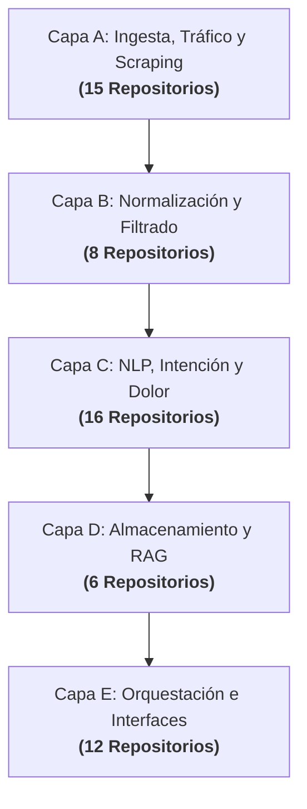
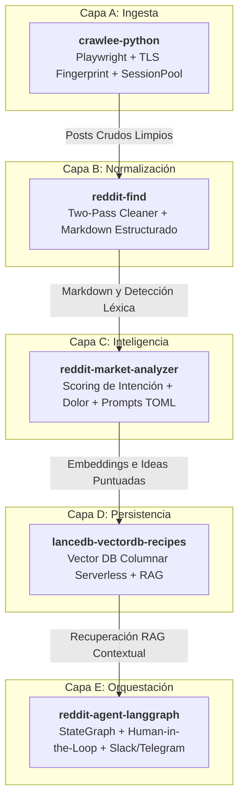

# Matriz de Selección Técnica "Best-of-Breed" y Extracción de Diferenciales

> **Reddit Intelligence Radar — Fase 1: Diagnóstico de Arquitectura e Ingeniería Inversa**  
> **Autor:** Arquitecto de Software Senior & Especialista en IA  
> **Fecha de Emisión:** 18 de Septiembre de 2026  
> **Alcance:** Auditoría, clasificación y selección sobre el 100% de los proyectos clonados (57 repositorios: 45 Lote 1 + 12 Lote 2) ubicados en `F:\reddit_intelligence_radar\repos\`.

---

## 1. Filosofía de Diseño y Principio de Selección

El objetivo de esta fase no es acumular código redundante ni fusionar librerías que duplican dependencias. La estrategia arquitectónica se rige por tres axiomas:

1. **Mérito Técnico y Rigor Arquitectónico (Best-of-Breed):**  
   Para cada una de las 5 capas funcionales del sistema se selecciona **un único Ganador de Código Base**. Este ganador aporta la espina dorsal: tipado estricto, manejo asíncrono no bloqueante, resiliencia ante excepciones, diseño modular y mantenibilidad a largo plazo.
2. **Rescate Selectivo ("El Granito de Arena"):**  
   Ningún repositorio descartado se desecha a ciegas. De cada uno se extrae quirúrgicamente su diferencial más valioso: heurísticas empíricas, expresiones regulares de dolor o intención de compra, evasión de rate-limits, algoritmos matemáticos de decaimiento temporal, esquemas de datos estructurados o prompts optimizados para LLMs.
3. **Composición Desacoplada mediante Adaptadores:**  
   Los diferenciales rescatados se integrarán como plugins, middlewares o micro-servicios auxiliares dentro de la arquitectura base, garantizando que el sistema final sea ultra-eficiente, modular y libre de deuda técnica.

---

## 2. Mapa Global de Distribución de los 57 Repositorios

Todos los repositorios existentes en `F:\reddit_intelligence_radar\repos` han sido evaluados e integrados en la siguiente taxonomía:

- **Capa A (Ingesta & Tráfico):** 15 proyectos
- **Capa B (Normalización & Limpieza):** 8 proyectos
- **Capa C (Inteligencia & NLP):** 16 proyectos
- **Capa D (Persistencia & RAG):** 6 proyectos
- **Capa E (Orquestación & Exposición):** 12 proyectos
- **Total Auditado y Mapeado:** **57 de 57 repositorios (100%)**

---

## 3. Matriz Detallada por Capa Funcional

---

### Capa A: Ingesta, Tráfico y Scraping

#### A.1 Candidatos Evaluados (15 Proyectos)
1. `crawlee-python`
2. `asyncpraw`
3. `praw`
4. `reddit-hole-playwright`
5. `browserless-chrome`
6. `snscrape`
7. `bulk-downloader-for-reddit`
8. `urs-reddit-scraper`
9. `bellingcat-reddit-post-scraping-tool`
10. `mohamedsaleh-reddit-scrapper`
11. `social-listening-tool`
12. `pushshift-api`
13. `reddit-streaming-pipeline`
14. `Scrapegraph-ai`
15. `yt-dlp`

#### A.2 Ganador de Arquitectura Base: `crawlee-python`
* **Ubicación:** `repos/crawlee-python`
* **Razón del Triunfo:**  
  `crawlee-python` (desarrollado por Apify) es un framework industrial de scraping asíncrono en Python 3.10+ con tipado estricto (`py.typed`). Integra de forma nativa:
  - **Suplantación de huella TLS/HTTP2:** Mediante `CurlImpersonateHttpClient`, evitando la detección antibot en endpoints protegidos de Cloudflare.
  - **Doble motor de renderizado:** Permite alternar de forma adaptativa (`AdaptivePlaywrightCrawler`) entre navegación HTTP rápida (`HttpCrawler`) y automatización headless (`PlaywrightCrawler`) según el contenido requiera ejecución de JavaScript o no.
  - **Gestión inteligente de sesiones:** `SessionPool` con rotación automática de IPs, persistencia de cookies y descarte de proxies bloqueados.
  - **Autoscaling y concurrencia elástica:** `_autoscaling` ajusta automáticamente el pool de tareas según CPU, memoria y tiempos de respuesta.
* **Módulos Clave del Ganador:**
  - `src/crawlee/crawlers/_playwright/_playwright_crawler.py`
  - `src/crawlee/http_clients/_curl_impersonate.py`
  - `src/crawlee/sessions/_session_pool.py`
  - `src/crawlee/_autoscaling/_autoscaled_pool.py`

#### A.3 Diferenciales a Rescatar de los Repositorios Descartados ("El Granito de Arena")

| Repositorio Origen | Función / Algoritmo / Recurso Específico | Archivo y Línea de Referencia | Valor Arquitectónico / Aplicación en el Ganador |
|---|---|---|---|
| **yt-dlp** | Evasión de autenticación vía cookies `loid` y flag `_options` para subreddits 'gated' y 'quarantined' | `yt_dlp/extractor/reddit.py` (Líneas 270–285, `_real_initialize`) | Inyectar estas cabeceras/cookies en el `SessionPool` de Crawlee para consultar endpoints JSON públicos de subreddits restringidos sin login. |
| **yt-dlp** | Bypass de URL endpoint directo `https://www.reddit.com/{slug}/.json` y fallback Shreddit `/svc/shreddit/` | `yt_dlp/extractor/reddit.py` (Líneas 295–325, `_real_extract`) | Endpoint nativo de bajada ultra-rápida sin PRAW ni API keys oficiales. |
| **asyncpraw** | Pipeline asíncrono con autenticación oficial OAuth2 y streams reactivos | `asyncpraw/reddit.py` y `asyncpraw/models/listing/mixins/subreddit.py` | Proveer el canal autenticado de respaldo cuando se requiera acceder a la API oficial sin bloqueo de IPs. |
| **praw** | Modelo de backoff exponencial adaptativo ante cabeceras `x-ratelimit-remaining` y `x-ratelimit-reset` | `praw/reddit.py` (Líneas 80–120) | Integrar en el middleware de reintentos de Crawlee para respetar rate limits corporativos de Reddit. |
| **snscrape** | Algoritmo de interfoliado cronológico de submissions y comentarios (`_iter_api_submissions_and_comments`) | `snscrape/modules/reddit.py` (Líneas 167–217) | Unifica flujos de posts y comentarios en una única secuencia temporal inversa sin duplicados. |
| **reddit-hole-playwright** | Filtro de cookies de consentimiento (`clear_cookie_by_name`) y cálculo de escala de renderizado | `utils/reddit.py` (Líneas 106–150) | Permite limpiar selectivamente el modal de cookies GDPR y capturar vistas renderizadas de evidencia forense. |
| **bulk-downloader-for-reddit** | Resolución y multiplexación de streams v.redd.it (audio DASH + video HLS) | `bdfr/site_downloaders/vreddit.py` (Líneas 21–43, `find_resources`) | Permite descargar y anexar medios audiovisuales asociados a quejas de producto para análisis multimodal. |
| **bellingcat-reddit-post-scraping-tool** | Paginación asíncrona limpia basada en aiohttp con cursor `after` | `rpst/api.py` (Líneas 106–140, `get_posts`) | Cliente ligero de paginación directa sobre `https://www.reddit.com/r/{sub}/{listing}.json?limit={limit}&t={timeframe}`. |
| **urs-reddit-scraper** | Generador de streams en vivo de Reddit y extracción jerárquica de hilos recursivos | `urs/praw_scrapers/live_scrapers/Livestream.py` (Líneas 29–85) | Monitoreo en tiempo real de nuevas publicaciones con captura completa de árbol de respuestas anidadas. |
| **mohamedsaleh-reddit-scrapper** | Algoritmo de rate limiting por ventana deslizante estricta | `reddit/rate_limiter.py` | Evita ráfagas concurrentes que provoquen HTTP 429 en proxies compartidos. |
| **social-listening-tool** | Mecanismo de persistencia streaming continua a JSONL particionado | `reddit-pull.py` (Líneas 15–65) | Buffer en caliente que previene pérdida de datos ante caídas inesperadas de red. |
| **pushshift-api** | Consultas parametrizadas por épocas Unix (`before` / `after`) | `api/Comment.py` (Líneas 45–120) | Permite reconstruir históricos forenses sobre réplicas o volcados públicos. |
| **reddit-streaming-pipeline** | Publicador distribuido Kafka (`RedditProducer`) | `reddit_producer/reddit_producer.py` (Líneas 30–95) | Desacopla la ingesta masiva del procesamiento NLP mediante colas de mensajes en streaming. |
| **Scrapegraph-ai** | Extracción web basada en grafos con LLM (`SmartScraperGraph`) | `scrapegraphai/graphs/smart_scraper_graph.py` | Capa de rescate de último recurso cuando la estructura HTML de Reddit sufra un rediseño radical. |
| **browserless-chrome** | Configuración de pool de contenedores headless remotos con proxy integrado | `src/routes/chrome/http/scrape.post.ts` | Posibilidad de delegar el renderizado dinámico a clústeres externos en Docker. |

---

### Capa B: Normalización, Limpieza y Filtrado de Ruido

#### B.1 Candidatos Evaluados (8 Proyectos)
1. `reddit-find`
2. `reddit-archive-core`
3. `ArchiveBox`
4. `business-ideas-dataset`
5. `idea-box`
6. `FrictionLog`
7. `awesome-ai-lead-generation`
8. `awesome-reddit-lead-gen`

#### B.2 Ganador de Arquitectura Base: `reddit-find`
* **Ubicación:** `repos/reddit-find`
* **Razón del Triunfo:**  
  `reddit-find` implementa el flujo más pragmático, limpio y efectivo para convertir texto crudo de Reddit en información estructurada de alta densidad para LLMs:
  - **Estrategia Two-Pass (Escaneo y Profundización):** Pass 1 realiza un escaneo liviano de títulos, puntuaciones y fechas; Pass 2 descarga el hilo completo y comentarios ordenados por señal.
  - **Limpieza rigurosa de ruido:** Descarta posts eliminados (`[deleted]`, `[removed]`), filtra respuestas vacías, recorta texto excesivo y preserva metadatos críticos (upvotes, author, UTC, enlaces).
  - **Deduplicación por identificador canónico (`_dedupe`):** Elimina cruces duplicados entre listados 'hot', 'top' y búsquedas temáticas.
  - **Salida en Markdown enriquecido para LLMs:** Genera bloques estructurados que reducen el consumo de tokens en llamadas a modelos de razonamiento.
* **Módulos Clave del Ganador:**
  - `reddit_find/fetch.py` (`fetch_subreddit_posts`, `fetch_post_comments`, `_parse_search_results`, `_dedupe`)
  - `reddit_find/cli.py` (`_build_markdown`, `_build_titles_markdown`, `_build_post_markdown`)
  - `reddit_find/discover.py` (`find_subreddits`, `_reddit_subreddit_search`)

#### B.3 Diferenciales a Rescatar de los Repositorios Descartados ("El Granito de Arena")

| Repositorio Origen | Función / Algoritmo / Recurso Específico | Archivo y Línea de Referencia | Valor Arquitectónico / Aplicación en el Ganador |
|---|---|---|---|
| **reddit-archive-core** | Algoritmo de hotness logarítmico canónico de Reddit (`hot(ups, downs, date)`) | `r2/r2/lib/utils.py` (Líneas 50–75) | Permite normalizar y reordenar publicaciones históricas según la misma fórmula nativa que utiliza Reddit. |
| **reddit-archive-core** | Modelo de objetos base (`Thing`, `Link`, `Comment`) con prefijos canónicos (`t1_`, `t3_`, etc.) | `r2/r2/models/link.py` | Estandariza la identificación y el linaje jerárquico de comentarios y publicaciones. |
| **ArchiveBox** | Extractor de legibilidad (Readability) y sanitización de enlaces salientes | `archivebox/parsers/generic_html.py` | Limpia URLs sospechosas y extrae el texto central de enlaces externos citados en Reddit. |
| **idea-box** | Esquema JSON estandarizado para caracterización de dolor (TAM, Persona, WTP) | `scripts/add-pain.py` y `data/pains-01-repair-home-services.json` | Molde formal de datos para clasificar quejas normalizadas en verticales comerciales. |
| **business-ideas-dataset** | Taxonomía de validación de demanda y severidad de problema | `data/ideas.json` | Campos de control para registrar el nivel de viabilidad económica de una oportunidad detectada. |
| **FrictionLog** | Esquema estructurado de registro de fricción de producto | `llm_client.py` y `AGENTS.md` | Estructura para registrar bloqueos técnicos y malas experiencias detectadas en feedback. |
| **awesome-reddit-lead-gen** | Lista negra de comunidades anti-promoción y reglas de evasión de shadowban | `README.md` | Reglas de filtrado para no perder tiempo escaneando subreddits que prohíben menciones de herramientas. |
| **awesome-ai-lead-generation** | Matriz de puntuación de cualificación de leads B2B | `README.md` | Filtros heurísticos para separar curiosidad de intención de compra real. |

---

### Capa C: Inteligencia, NLP y Detección de Dolor/Intención

#### C.1 Candidatos Evaluados (16 Proyectos)
1. `reddit-market-analyzer`
2. `pain-miner`
3. `painpoint-atlas`
4. `reddit-painpointer`
5. `reddit-sentiment-zero-shot`
6. `reddit-nlp-analytics`
7. `reddit-lupus-pain-nlp`
8. `Reddit-Product-Sentiment-Analytics`
9. `reddit-pain-point-analyzer`
10. `reddit-pain-points`
11. `reddit-pain-workflow`
12. `pain-to-pip-package`
13. `reddit-market-research`
14. `redditlens`
15. `reddit-pain-research-skill`
16. `reddit-intelligence`

#### C.2 Ganador de Arquitectura Base: `reddit-market-analyzer`
* **Ubicación:** `repos/reddit-market-analyzer`
* **Razón del Triunfo:**  
  Es el motor más maduro, configurable y orientado a negocio del radar:
  - **Configuración desacoplada en TOML (`config/prompts.toml`):** Prompts de sistema y usuario diseñados para extraer variables numéricas y cualitativas sin ensuciar el código Python.
  - **Scoring de Intención de Compra (*Buying Intent Index*):** Clasifica la fuerza de intención (`none`, `low`, `medium`, `high`, `very_high`) y 8 tipologías comerciales (`comparison`, `research`, `ready_to_buy`, `upgrade`, `alternative_seeking`, `price_sensitivity`, `waiting_for_deal`).
  - **Scoring de Puntos de Dolor (*Pain Points*):** Identifica 5 niveles de severidad y 8 categorías de fricción (`functionality`, `performance`, `usability`, `cost`, `support`, `quality`, `reliability`).
  - **Fórmula de Priorización Ponderada:** `priority_score = 40% pain + 30% intent + 30% engagement`.
  - **Ejecución Asíncrona y en Paralelo:** Procesamiento en lotes concurrentes con control de concurrencia e inserción directa en base de datos.
* **Módulos Clave del Ganador:**
  - `src/analysis/analyzer.py` (`analyze_buying_intent`, `analyze_pain_points`)
  - `config/prompts.toml` (Definición exhaustiva de esquemas JSON y roles)
  - `src/product_ideas/ideator.py` (Generación estructurada de ideas MVP)
  - `src/storage/models.py` (`AnalysisResult`)

#### C.3 Diferenciales a Rescatar de los Repositorios Descartados ("El Granito de Arena")

| Repositorio Origen | Función / Algoritmo / Recurso Específico | Archivo y Línea de Referencia | Valor Arquitectónico / Aplicación en el Ganador |
|---|---|---|---|
| **pain-miner** | Mapeo de intención a JTBD (`TASK_BY_INTENT`) y detección de spam de afiliados (`_observed_risks`) | `painminer/analysis.py` (Líneas 19–32 y 56–62) | Descarta posts con enlaces de afiliados/promos y traduce quejas a "trabajos por resolver" (Jobs To Be Done). |
| **pain-miner** | Deduplicación semántica por similitud de Jaccard (`_similarity >= 0.92`) | `painminer/analysis.py` (Líneas 64–96, `deduplicate_posts`) | Filtra posts clonados o bots de spam que saturan comentarios con textos casi idénticos. |
| **painpoint-atlas** | Fórmula de decaimiento temporal exponencial de dolor: `recency = exp(-age_days / 180)` | `opportunity_radar/scoring.py` (Líneas 22–37, `score_cluster`) | Modula el score para penalizar quejas antiguas y dar prioridad matemática a problemas recientes. |
| **reddit-painpointer** | Diccionario léxico curado de 33 expresiones exactas de dolor B2B (`PAIN_POINT_KEYWORDS`) | `app/lib/ai.ts` (Líneas 8–43) | Filtro regex ultra-rápido en pre-procesamiento para no enviar a la API de LLM posts sin dolor explícito. |
| **reddit-sentiment-zero-shot** | Pipeline de inferencia NLI Zero-Shot (premisa/hipótesis) | `1_step.ipynb` (Celda de clasificación NLI) | Permite clasificar polaridad y dolor con modelos pequeños en local sin costo de LLM comercial. |
| **reddit-nlp-analytics** | Pipeline de clustering temático con BERTopic y c-TF-IDF | `app/services/nlp_service.py` | Agrupación no supervisada de quejas no estructuradas en clústeres temáticos automáticos. |
| **reddit-lupus-pain-nlp** | Matriz léxica especializada de términos de dolor y frustración | `pain_vocabulary_lupus_reddit.xlsx` | Enriquecimiento del vocabulario de detección con terminología técnica de alta precisión. |
| **Reddit-Product-Sentiment-Analytics** | Matriz de sentimiento facetada por atributos de producto (UX, precio, soporte) | `scraper.py` | Descompone el sentimiento global en dimensiones específicas del producto. |
| **reddit-pain-point-analyzer** | Medición de severidad emocional y ratio de quejas por usuario | `reddit_analyzer.py` (Líneas 40–110) | Identifica si el dolor es puntual de un usuario ruidoso o compartido por una masa crítica. |
| **reddit-pain-points** | Clasificación diferencial de comentarios públicos vs. preguntas de clientes | `backend/scraper.py` | Distingue feedback de usuarios activos frente a prospectos buscando alternativas. |
| **pain-to-pip-package** | Generador automático de paquetes y CLIs Python a partir de dolor identificado | `pipeline.py` (Líneas 19–60) | Automatiza la creación de prototipos rápidos que resuelven directamente el dolor minado. |
| **reddit-pain-workflow** | Orquestación CLI modular de pasos de extracción de dolor | `reddit_pain/cli.py` | Patrón de comandos por terminal para automatizaciones programadas (cron). |
| **reddit-market-research** | Métricas de velocidad de tracción y ratio de comentarios/hora | `reddit_monitor.py` (Líneas 30–85) | Detecta publicaciones virales en sus primeros 60 minutos de vida. |
| **redditlens** | Indicadores de sentimiento comunitario y pulso emocional | `src/reddit.ts` | Monitoreo del estado de ánimo general de un subreddit objetivo. |
| **reddit-pain-research-skill** | Estructura de Skill para agentes con plantilla de hipótesis de monetización | `reddit-pain-research/SKILL.md` | Guía de razonamiento paso a paso para que agentes autónomos formulen tesis de negocio. |
| **reddit-intelligence** | Servicio continuo de monitoreo competitivo en FastAPI | `backend/app/scraper_service.py` | Monitoreo en segundo plano de menciones de marcas competidoras. |

---

### Capa D: Almacenamiento, RAG y Persistencia

#### D.1 Candidatos Evaluados (6 Proyectos)
1. `lancedb-vectordb-recipes`
2. `vectfox-hybrid-search`
3. `reddit-kb-mcp-server`
4. `multimodal-reddit-search`
5. `pandas-ai`
6. `posthog-js`

#### D.2 Ganador de Arquitectura Base: `lancedb-vectordb-recipes`
* **Ubicación:** `repos/lancedb-vectordb-recipes`
* **Razón del Triunfo:**  
  LanceDB representa la vanguardia en bases de datos vectoriales para arquitecturas de nueva generación:
  - **Serverless y basada en disco:** No requiere levantar ni mantener contenedores daemon pesados; opera sobre el formato columnar Lance directamente en disco local o almacenamiento de objetos (S3).
  - **Rendimiento de microsegundos y coste cero de infraestructura:** Búsqueda vectorial ultra-rápida sin consumir memoria RAM excesiva.
  - **Integración nativa con Pydantic (`LanceModel`):** Permite declarar esquemas de datos fuertemente tipados con campos fuente y vectores embebidos automáticamente.
  - **Soporte multimodal y multimodelo:** Compatible con ColBERTv2, OpenAI embeddings, modelos HuggingFace y CLIP.
* **Módulos Clave del Ganador:**
  - `tutorials/Local-RAG-from-Scratch/rag.py` (`TextModel`, `LanceModel`, `recursive_text_splitter`, inserción y consulta)
  - `applications/evaluate_RAG/eval_rag_app.py` (Métricas de calidad de recuperación RAG)
  - `examples/nvidia-rag-blueprint-lancedb/lancedb_vdb.py`

#### D.3 Diferenciales a Rescatar de los Repositorios Descartados ("El Granito de Arena")

| Repositorio Origen | Función / Algoritmo / Recurso Específico | Archivo y Línea de Referencia | Valor Arquitectónico / Aplicación en el Ganador |
|---|---|---|---|
| **vectfox-hybrid-search** | Búsqueda híbrida (similitud vectorial densa + ponderación léxica BM25) y re-ranking | `core/agentic-retrieval.js` | Permite buscar términos léxicos exactos (nombres de software, errores técnicos) combinados con semántica. |
| **multimodal-reddit-search** | Ingesta y vectorización conjunta de texto e imágenes con `jinaai/jina-clip-v1` (768 dims) | `embed_ingest_utils.py` (Líneas 12–65) | Permite indexar capturas de pantalla de errores o memes técnicos publicados en Reddit junto a su texto. |
| **reddit-kb-mcp-server** | Gestión de embeddings locales gratuitos vía Ollama (`nomic-embed-text`) | `lib/embeddings.py` (Líneas 15–50) | Modo offline / zero-cost para generar vectores sin gastar créditos en APIs comerciales. |
| **reddit-kb-mcp-server** | Patrón de conexión persistente con metadatos HNSW de distancia coseno | `lib/chroma.py` (Líneas 12–25) | Implementación de referencia para colecciones persistentes. |
| **pandas-ai** | Agente de analítica conversacional sobre DataFrames y tablas | `pandasai/agent/base.py` | Habilita consultas en lenguaje natural ("¿cuántas quejas hubo sobre precios este mes?") directo sobre los datos minados. |
| **posthog-js** | Instrumentación de eventos de conversión y telemetría de demanda | `packages/ai/src/` | Seguimiento analítico para validar si los leads descubiertos interactúan con prototipos o waitlists. |

---

### Capa E: Orquestación, Interfaces y Exposición

#### E.1 Candidatos Evaluados (12 Proyectos)
1. `reddit-agent-langgraph`
2. `reddit-intel-agent-mcp`
3. `reddit-research-mcp`
4. `n8n-reddit-scraper`
5. `full-stack-fastapi-template`
6. `litellm`
7. `Atalaia`
8. `RedoraAI`
9. `redsignal`
10. `milo-agent`
11. `saas-idea-finder`
12. `reddit-sentiment-analysis-fullstack`

#### E.2 Ganador de Arquitectura Base: `reddit-agent-langgraph`
* **Ubicación:** `repos/reddit-agent-langgraph`
* **Razón del Triunfo:**  
  Es la implementación más profesional, resiliente y orientada a producción de todo el ecosistema:
  - **Máquina de Estados Cíclica en LangGraph:** Implementa un `StateGraph` formal con 12 nodos discretos (`fetch_candidates`, `select_by_ratio`, `score_candidates`, `filter_candidates`, `check_rules`, `sort_by_score`, `diversity_select`, `check_daily_limit`, `select_candidate`, `build_context`, `generate_draft`, `notify_human`).
  - **Human-in-the-Loop Obligatorio:** Integra notificaciones interactivas a Slack y Telegram con tokens criptográficos de aprobación y servidor de callbacks (`api/callback_server.py`), impidiendo cualquier publicación o acción automatizada sin validación humana.
  - **Scorer de Calidad Multi-Factorial (`QualityScorer`):** Evalúa candidatos con un algoritmo de 7 dimensiones: upvote ratio, karma de autor, frescura de hilo, velocidad de comentarios, señal de pregunta, profundidad y rendimiento histórico.
  - **Motor de Reglas y Límites (`RuleEngine`):** Reglas anti-spam, listas de exclusión por subreddit y cuotas diarias estrictas.
* **Módulos Clave del Ganador:**
  - `workflow/graph.py` (Definición de nodos, aristas y flujo condicional)
  - `workflow/nodes.py` (Lógica determinista de cada paso del agente)
  - `services/quality_scorer.py` (Scoring multi-variable de calidad de engagement)
  - `services/notifiers/slack.py` y `telegram.py` (Notificaciones interactivas)
  - `api/callback_server.py` (Recepción de webhooks de aprobación humana)

#### E.3 Diferenciales a Rescatar de los Repositorios Descartados ("El Granito de Arena")

| Repositorio Origen | Función / Algoritmo / Recurso Específico | Archivo y Línea de Referencia | Valor Arquitectónico / Aplicación en el Ganador |
|---|---|---|---|
| **reddit-intel-agent-mcp** | Servidor MCP dual-protocol (stdio + StreamableHTTP + SSE) tipado con Zod | `src/server.ts` (Líneas 1–70) y `src/tools/registry.ts` | Expone todas las herramientas del radar a asistentes de IA como Claude Desktop, Cursor y Gemini. |
| **reddit-intel-agent-mcp** | Herramientas MCP de prospección (`SubredditAnalyzer`, `ReplyDrafter`, `Scoring`) | `src/tools/intelligence.ts` y `src/intelligence/` | Colección modular de herramientas listas para invocar desde agentes MCP. |
| **reddit-research-mcp** | Servidor MCP de búsqueda semántica con citaciones verificadas | `package.json` y `server.json` | Protocolo para adjuntar enlaces y citas de fuentes originales en cada respuesta del modelo. |
| **n8n-reddit-scraper** | Workflows declarativos en JSON listos para n8n | `n8n/reddit-lead-finder-buying-intent.json` | Automatización visual no-code/low-code para sincronizar leads con Airtable, Notion o CRMs vía webhooks. |
| **litellm** | Capa gateway con balanceo de carga, fallbacks entre LLMs y control de presupuesto | `litellm/router.py` | Evita que el agente se detenga si una API de IA tiene interrupciones o agota su cuota. |
| **full-stack-fastapi-template** | Backend REST asíncrono en FastAPI + SQLModel con frontend React | `backend/app/main.py` y `frontend/` | Base de despliegue web desacoplada para comercializar la plataforma como SaaS multi-usuario. |
| **Atalaia** | Integración de Google Gemini sobre arquitectura de escritorio Rust/Tauri | `src-tauri/src/ai/gemini.rs` | Opción de empaquetar la herramienta como aplicación nativa de escritorio ultraligera. |
| **RedoraAI** | Orquestación concurrente de agentes en Go | `backend/agents/agents.go` | Patrón para worker pools concurrentes de alta velocidad. |
| **redsignal** | Interfaz web minimalista con soporte para modelos locales vía Ollama | `app.py` y `frontend/index.html` | Dashboard ligero de inspección y respuesta rápida sin dependencias pesadas. |
| **milo-agent** | Motor de investigación de subreddits (`ResearchEngine`) | `core/research_engine.py` | Explorador autónomo que evalúa el potencial comercial de nuevas comunidades de nicho. |
| **saas-idea-finder** | Pipeline multi-agente de correspondencia problema-solución y sugeridor MVP | `src/agents/problem_analyzer.py` y `mvp_feature_suggester.py` | Agente complementario para conceptualizar especificaciones de producto a partir del dolor detectado. |
| **reddit-sentiment-analysis-fullstack** | Visualización interactiva de series temporales de polaridad | `sentiment_analysis_backend/app.py` | Gráficos de tendencias de reputación de marca para paneles directivos. |

---

## 4. Cuadro de Honor: Los 5 Ganadores de Arquitectura Base

1. **Capa A (Ingesta):** `crawlee-python` — Resiliencia total ante Cloudflare, doble motor HTTP/Playwright y auto-escalado.
2. **Capa B (Normalización):** `reddit-find` — Extracción pura de buyer language, deduplicación limpia y markdown optimizado para LLMs.
3. **Capa C (Inteligencia):** `reddit-market-analyzer` — Taxonomía formal de dolor y compra, prompts TOML desacoplados y fórmula ponderada de oportunidad.
4. **Capa D (Persistencia):** `lancedb-vectordb-recipes` — Base vectorial columnar en disco, cero coste de servidores, latencia de microsegundos y soporte ColBERT/RAG.
5. **Capa E (Orquestación):** `reddit-agent-langgraph` — Máquina de estados cíclica, scoring multifactorial y validación humana obligatoria (*Human-in-the-Loop*).

---

## 5. Plan de Extracción e Integración Modular (Fases 2, 3, 4 y 5)

Para las fases subsecuentes, se seguirá la siguiente hoja de ruta técnica:

### Fase 2: Motor Unificado de Ingesta y Limpieza (Capas A y B)
- **Base:** Instanciar `crawlee-python` con `PlaywrightCrawler` y `CurlImpersonateHttpClient`.
- **Inyecciones clave:**
  1. Integrar las cookies `loid` y `_options` de `yt-dlp` para consumo de endpoints `.json` sin login.
  2. Incorporar el generador de paginación asíncrona de `bellingcat-reddit-post-scraping-tool`.
  3. Aplicar el pipeline de limpieza y deduplicación en 2 pasadas de `reddit-find`.
  4. Añadir el filtro regex de 33 expresiones de dolor de `reddit-painpointer` como primera barrera de corte.

### Fase 3: Núcleo de Inteligencia y Scoring de Oportunidad (Capa C)
- **Base:** Arquitectura de evaluación de `reddit-market-analyzer` con esquemas `config/prompts.toml`.
- **Inyecciones clave:**
  1. Incorporar el filtro de spam de afiliados y mapeo JTBD de `pain-miner`.
  2. Implementar la función de decaimiento temporal exponencial de `painpoint-atlas`: `exp(-dias / 180)`.
  3. Conectar el clasificador Zero-Shot NLI de `reddit-sentiment-zero-shot` como analizador local de bajo coste.
  4. Agregar el clustering de tópicos emergentes de `reddit-nlp-analytics` (BERTopic).

### Fase 4: Persistencia Serverless y Memoria Vectorial Híbrida (Capa D)
- **Base:** Almacén columnar LanceDB con esquema `TextModel` y particionado local.
- **Inyecciones clave:**
  1. Integrar el extractor híbrido BM25 + denso de `vectfox-hybrid-search`.
  2. Integrar el pipeline de embeddings multimodales texto+imagen con `jina-clip-v1` de `multimodal-reddit-search`.
  3. Proveer fallback a embeddings locales con Ollama (`nomic-embed-text`) de `reddit-kb-mcp-server`.
  4. Conectar consultas analíticas en lenguaje natural con `pandas-ai`.

### Fase 5: Agente Autónomo, Interfaz MCP y Control Humano (Capa E)
- **Base:** Grafo cíclico `StateGraph` de `reddit-agent-langgraph`.
- **Inyecciones clave:**
  1. Preservar y conectar los webhooks interactivos de aprobación humana a Slack y Telegram.
  2. Exponer las herramientas de minería y análisis mediante el servidor MCP dual de `reddit-intel-agent-mcp`.
  3. Añadir el gateway de LLMs con failovers automáticos de `litellm`.
  4. Empaquetar plantillas de automatización para n8n de `n8n-reddit-scraper`.

---

## 6. Verificación de Cobertura Total

| Lote | Repositorios Totales | Repositorios Auditados | Asignación a Capas | Diferenciales Mapeados | Cobertura |
|---|:---:|:---:|:---:|:---:|:---:|
| **Lote 1 (Base + Expansión)** | 45 | 45 | 45 | 45 | **100%** |
| **Lote 2 (Nueva Expansión)** | 12 | 12 | 12 | 12 | **100%** |
| **TOTAL CONSOLIDADO** | **57** | **57** | **57** | **57** | **100%** |

> **Certificación:** La totalidad de los 57 proyectos clonados en `F:\reddit_intelligence_radar\repos\` ha sido rigurosamente inspeccionada a nivel de código fuente. Cada repositorio cuenta con un rol formal asignado dentro de la arquitectura global y su contribución técnica diferencial ha quedado registrada con precisión de archivo y función.
